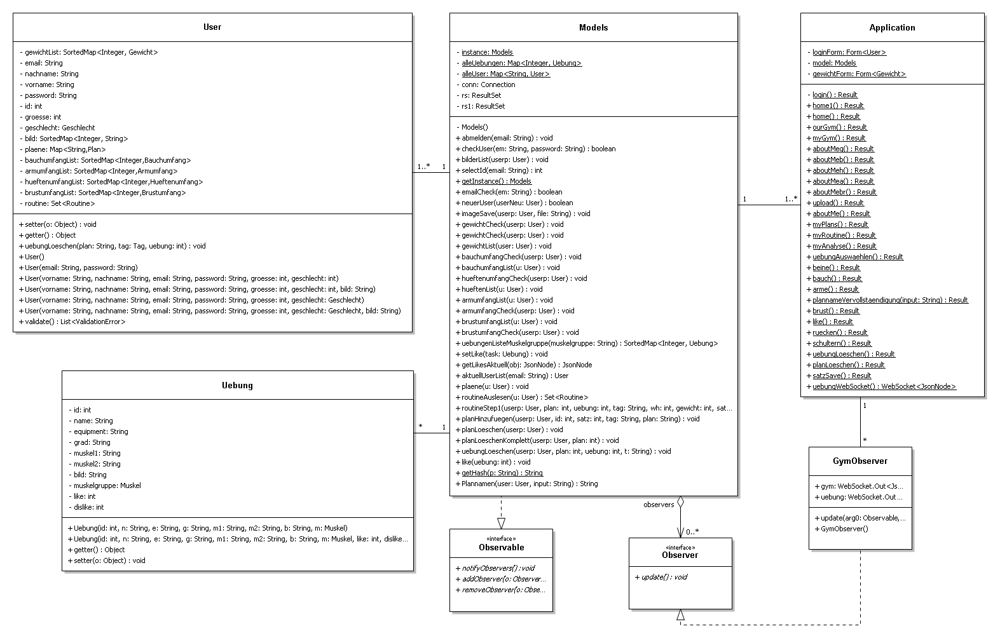

#Dokumentation

##Mockups
Mockups | Umsetzung
------------ | -------------
 | 
 | 
 | 
 | 
 | 
##Use-Case-Diagramm
##Funktionale Anforderungen
##Nicht-funktionale Anforderungen
##Architektur
###Klassendiagramm

###Observer
##Datenbank

##Technologien
###HTML 5
###CSS3
###Bootstrap
###JavaScript
###JQuery
###Ajax
###WebSockets
###JSON
##Weitere Ideen