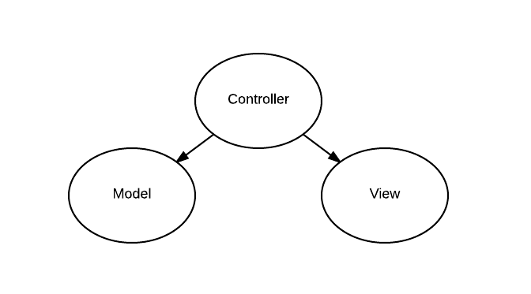

#Dokumentation
**@Gym** ist eine Webaplikation, die bei der Sportroutine unterstützt. Sie erlaubt dem User seinen persönlichen Trainingsplan zu erstellen, sein Training zu dokumentieren und die Trainingserfolge zu errechnen

##Die ersten Ideen und ihre Realisierung
Um das Design und die Struktur der Webapplikation zu erstellen, wurden am Anfang vom Projekt Mockups entwickelt. Einige sind in der folgenden Tabelle zu sehen. 
Während der Entwicklung mussten ein Paar Änderungen vorgenommen werden, die Hauptidee ist aber erhalten geblieben. 
#
Die Benutzung der Seite ist erst nach der Registrierung möglich. Die Webapplikation wird in zwei Bereiche geteilt: der private Bereich *myGym* und der 
öffentliche Bereich *ourGym*. Im öffentlichen Bereich werden Übungen aufgelistet, die nach Muskelgruppen sortiert sind. Man kann sie auswählen und so 
Fitnesspläne erstellen. Im privaten Bereich werden persönliche Daten vom User gezeigt: Daten über die Person, zusammengestellte Pläne, Routinen und die Entwicklung.
#
Um das Design ansprechend zu halten, werden viele Bilder eingesetzt. Damit die Seite seriös und nicht überladen wirkt, sind als herrschende Farben schwarz, grau, 
weiss und neongrün ausgwählt worden.
#
Mockups | Realisierung
------------ | -------------
 | 
 | 
 | 
 | 
 |           
##Funktionale Anforderungen
Die funktionalen Anforderungen der Webapplikation *@Gym* werden im folgenden Use Cases Diagramm präsentiert:

Um die Webapplikation zu nutzen muss der User sich registrieren bzw. anmelden. Nachdem er sich angemeldet hat, kann er Übungen anschauen, sie auswählen und so seine Fitnesspläne 
erstellen. Wenn der User mindestens einen Plan erstellt hat, kann er seine Routine durchführen und die Daten eingeben. Der User kann Bilder hochladen und persönliche Daten aktualisieren. 
Wenn die Daten aktualisiert wurden, oder wenn die Routine durchgeführt wurde, kann er die Historie anschauen. Der User kann die Pläne ändern, indem er Übungen aus dem Plan löscht oder neue 
Übungen hinzufügt. Er kann aber auch den gesamten Plan löschen. Wenn eine Übung dem User gut gefällt, hat er die Möglichkeit, das den Anderen mitzuteilen, indem er die Übung liked.
##Nicht-funktionale Anforderungen
* Ansprechendes und seriöses Design
* Kundenfreundlichkeit
* Sicherheit
* Performanz          
                  
##Architektur
###Model View Controller
Die Webapplikation ist nach dem Schema *Model View Controller* aufgebaut, das auf dem folgen Bild dargestellt ist. 
                   
View beinhaltet alle html Seiten. In Model befindet sich die Logik und die Datenbank. 
Model und View können nicht direkt kommunizieren. Die Kommunikation erfolgt über den Controller. Er hat Zugriff sowohl auf Model als auch auf View. Durch ein Event bei View wird Controller benachricht, was in View geschehen 
ist. Dann kann der Controller reagieren und die Aktion vom Model holen.       
                  
Die Klassen *Application* und *GymObserver* sind Controllers. Die anderen Klassen gehören zu Model. Zugriff von *Application* auf Model geschieht über die Klasse *Models*. Die Klassen der Webapplikation 
werden im folgenden Kapitel ausführlicher erklärt.               
###Klassendiagramm
Wie schon erwähnt wurde, zu Controllers gehören zwei Klassen: *Application* und *GymObserver*. Model enthält 23 Klassen. *Models*, *User* und *Uebungen* sind die Wichtigsten. Diese Klassen sind im 
folgenden Klassendiagramm präsentiert.

*Application* kommuniziert mit Model über die Klasse *Models*. Diese Klasse verwaltet alle anderen Klassen des Models und greift auf die Datenbank zu.                
###Observer und Observable
Um die Websockets zu realisieren wurden Observer und Observable verwendet. Wie man im Klassendiagramm erkennen kann, ist die Klasse *GymObserver* Observer und *Models* Observable. 
Wenn die Methode *like(int uebung)* in *Models* aufgerufen wird, werden die Observers über den Aufruf der Methode notifyObservers() über die Änderungen informiert. Dadurch können die angemeldeten User immer die 
aktuelle Anzahl von Likes sehen.       
##Datenbank      
Für die Webapplikation wurde eine SQLite Datenbank benutzt. Damit die Datenbank leicht zu pflegen und zu erweitern ist, wurde sie in der 3. Normalform entwickelt. 
Zugriff auf die Datenbank wird über JDBC realisiert. Um die Sicherheit der Webapplikation zu erhöhen, wurden PreparedStatements benutzt.
Passwörter von Usern sind ebenfalls geschützt und werden in der Datenbank verschlüßelt gespeichert. Für die Verschlüsserung wurde der Secure Hash Algorithm benutzt.
                                 
##Technologien
###HTML 5
###CSS3
###Bootstrap
###JavaScript
###JQuery
###Ajax
###WebSockets
###JSON
##Weitere Ideen